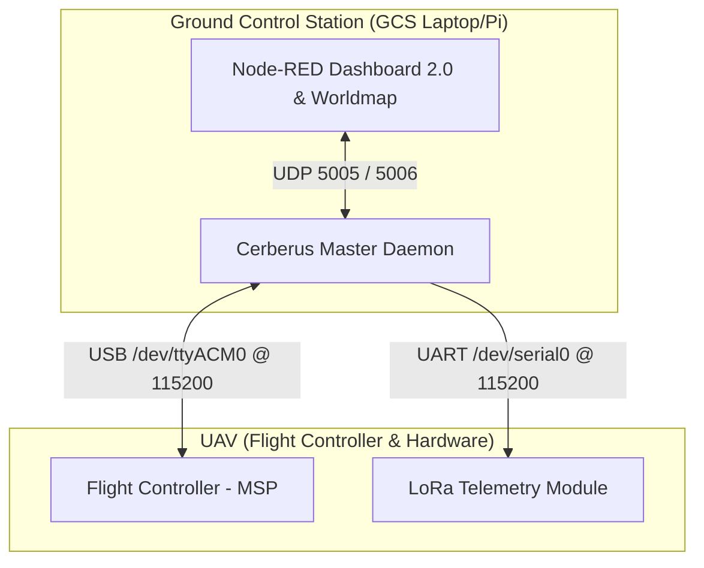

# Cerberus (Flight Controller's Ground Control Station)

CerberusFC-GCS is a custom Ground Control Station telemetry gateway and interactive dashboard designed for autonomous missions on UAVs (like a Raspberry Pi 3B paired with an INAV-powered Flight Controller). 

The system leverages a high-performance Python daemon (`cerberus_master.py`) to bridge the Flight Controller (MSP protocol), an external LoRa telemetry link, and an interactive web dashboard built on Node-RED (using Dashboard 2.0 and Worldmap).

---

## System Architecture



---

## Directory Layout

*   **`cerberus_master.py`**: The core gateway program. Handles state management, MSP protocol commands, LoRa CSV logging, and UDP communications with Node-RED.
*   **`node-red/`**: Recovered Node-RED user directory containing:
    *   `flows.json`: The complete backend logic and dashboard UI definitions.
    *   `settings.js`: Configuration rules (e.g., custom login username/password and security settings).
    *   `package.json`: Declaration of dependencies, including `@flowfuse/node-red-dashboard` and `node-red-contrib-web-worldmap`.

---

## 🛸 The Python Daemon (`cerberus_master.py`)

The python script acts as an intelligent daemon, polling telemetry from the flight controller at 10Hz and managing the safety/flight modes at 50Hz.

### Key Features:
1.  **Multiwii Serial Protocol (MSP)**: Implements native MSP commands to read:
    *   `MSP_STATUS` (Arm status)
    *   `MSP_ATTITUDE` (Roll, pitch, yaw)
    *   `MSP_RAW_GPS` (Fix status, satellite count, latitude, longitude, and speed)
    *   `MSP_ALTITUDE` (Estimated altitude and vertical velocity)
    *   `MSP_ANALOG` (Battery voltage, current, and consumed capacity)
2.  **Robust Arming/Disarming State Machine**:
    *   **`DISARMED`**: Holds all sticks in safe positions.
    *   **`BYPASSING_CHECKS`**: Automatically holds the stick arming gesture (Throttle Low, Yaw Right, CH7 Active). Once telemetry confirms that the FC has armed, it instantly returns the yaw to center to prevent vehicle spinning upon boot. Includes a 5-second timeout safeguard.
    *   **`ARMED_IDLE`**: Sits safely with motors spinning at idle speed, waiting for the user to initiate the mission launch.
    *   **`MISSION_ACTIVE`**: Throttle goes to mid (1500) and triggers the INAV Waypoint Navigation channel (Aux2/CH6).
3.  **Mission Waypoint Injector (MSP 209)**: Dynamically parses mission maps, structures waypoint parameters (Latitude, Longitude, Altitude, Actions like hover, RTH, land, or loiter), flashes the configuration block to the Flight Controller, and issues an `EEPROM_WRITE` to save the mission profile.
4.  **LoRa Telemetry Broadcaster**: Packs live metrics into a CSV format string and writes it via UART (`/dev/serial0`) to broadcast remote telemetry over long distances.

---

## 📊 Node-RED Dashboard

The dashboard provides a custom cockpit UI utilizing the latest **FlowFuse Dashboard 2.0** framework.

### Features:
*   **Interactive Waypoint Planner**: Uses `node-red-contrib-web-worldmap` to draw flight paths, view current drone positions, place markers, and compile waypoints to push to the Python daemon.
*   **Live Telemetry HUD**: Monitors battery status, attitude angles, altitude, GPS status, and current active system flight states.
*   **Secure Access control**: Password-protected using the `Cerberus GCS` account configuration.

---

## ⚙️ Getting Started

### Prerequisites
1.  **Node.js**: `v20` or higher
2.  **Python**: `3.x` with `pyserial` installed

### Installation & Launching

1.  **Install Python Dependencies**:
    ```bash
    pip install pyserial
    ```

2.  **Start the Python Daemon**:
    Ensure your Flight Controller is connected to `/dev/ttyACM0` (or update the config inside the script) and run:
    ```bash
    python3 cerberus_master.py
    ```

3.  **Launch Node-RED**:
    Initialize the local dashboard from the directory containing your configuration files:
    ```bash
    npx node-red --userDir ./node-red
    ```

4.  **Access the Dashboard**:
    *   **Editor Panel**: [http://localhost:1880/](http://localhost:1880/)
    *   **Dashboard Screen**: [http://localhost:1880/dashboard/](http://localhost:1880/dashboard/)
    *   *Credentials:* Username: `Cerberus GCS` | Password: `CerberusPass123!`
